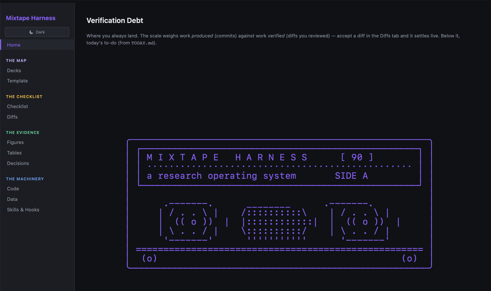

# GTD — a zero-error harness for causal-inference research



This repo is a **research harness**: a set of interlocking rules, checklists, skills, hooks, and a live
dashboard that keep an AI-assisted difference-in-differences project honest, reproducible, and
resistant to drift. It is a *template* — clone it, point it at your own study, and it enforces a
zero-error discipline as you work.

The core problem it solves: when an AI can produce 200 lines of analysis in one shot, the human can no
longer verify line-by-line as they go. Production outran verification. This harness re-couples them —
every figure traces to a script, every stage is gated, every claim is defended before it advances, and
both the human *and* the AI are assumed to drift (differently), so the record lives on disk where
neither's memory can lie.

## Start here

1. **Read `CLAUDE.md`.** It is the law of the harness — written for the AI, but the human should read it
   too. It explains the zero-error constraint, the stage "canisters," the "You Are Here" stage-lock
   model, provenance discipline, and the figure/deck standards. Everything else is downstream of it.
2. **Open the dashboard:** run `./open_dashboard.command` (needs `python3` on PATH; serves at
   `localhost:8080`). It reads the filesystem live on every request, so it never goes stale. It is the
   visual enforcement layer — stale outputs, unreviewed diffs, and open stages are all shown in color.
3. **Start a project:** invoke the `/newproject` skill to scaffold, then `/covariates` (if DiD) and walk
   `checklists/` one stage at a time. Each analysis lives in `analyses/<slug>/` with per-stage rooms.

## The map

| Path | What it is |
|---|---|
| `CLAUDE.md` | The harness law — read first. |
| `checklists/` | The DiD / continuous-DiD / synth checklists every analysis walks. Templates; never edited. |
| `analyses/` | One folder per analysis. `_template/` is the scaffold copied per analysis; its `stages/` are the checklist steps (`00_packages` … `09_rerun`). The Brazil CAPS study (Dias & Fontes 2024) is the teaching illustration — see *A note on the example* below. |
| `skills/` | The instruments: `amnesia` (reorient), `newproject`, `covariates`, `pipeline`, `referee2` (audit), `blindspot` (perception audit), `drift-sweep`, `bibcheck`. |
| `hooks/` | The guardrails that *enforce* the rules — Python scripts registered in `settings.json` (see `hooks/settings.snippet.json`): `protect-raw-data` (raw data is immutable), `no-fabricated-exhibit` (no figure/table from made-up data, unless a labeled Monte Carlo), `no-offbook-exhibit` (exhibits only from named scripts, never inline in a shell), `deck-from-pipeline` (deck only an exhibit a wired script rebuilds), `no-stale-canon` (warn when a canonized exhibit is missing, unwired, or stale). |
| `dashboard_server.py` | The live dashboard — checklist grid, figures/tables, diffs, verification scale. |
| `scripts/` | Harness helpers (manifest, ledger, sample-flow). Your analysis's build scripts are yours to add. |
| `STATE.md` | The always-current "where am I" orientation file. Read on entry, updated continuously. |

## The stage-lock model in one picture

The checklist grid colors every stage by **one rule — a stage's color IS its lock state** (like a mall map):

```
  GREEN = done   — the stage carries a LOCKED file (shut / signed off)
  AMBER = active — the ONE stage you're in ("You Are Here"); only ever one
  RED   = open   — everything else (not locked, not active)
```

To *work* a stage you unlock it (remove its `LOCKED` file). To move on, lock the room you're leaving and
point `ACTIVE_STAGE` at the next. Sign-off is just the final stage — locking it means the analysis is done.

## Conventions

- Raw data is immutable (`data/raw/`); every transform is code that writes to `data/derived/`.
- Figures → `output/figures/` (PDF + PNG); tables → `output/tables/`.
- Every number traces through code to real, unmodified data. No exhibit is fabricated; Monte Carlo is
  the one labeled carve-out. (See CLAUDE.md's provenance rule.)
- These conventions are not just prose. The `hooks/` **enforce** them mechanically — a `PreToolUse`
  hook blocks an edit to raw data or a fabricated-figure script *before* it runs, and a `PostToolUse`
  hook flags a decked exhibit the pipeline cannot rebuild. Prose asks; a hook guarantees.

## A note on the example

The running example in `CLAUDE.md` is the Brazil **CAPS mental-health reform** study (Dias & Fontes 2024), used as a *teaching illustration* of what a
walked checklist looks like. The repo does **not** ship the data or build scripts — it shows the
*shape* of an analysis, not a runnable pipeline. Copy `analyses/_template/` (or run `/newproject`) when you start your own.
